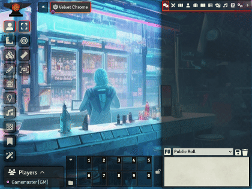
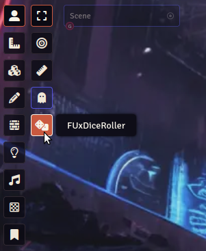
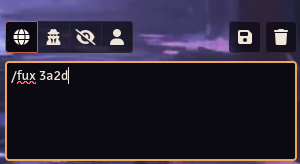
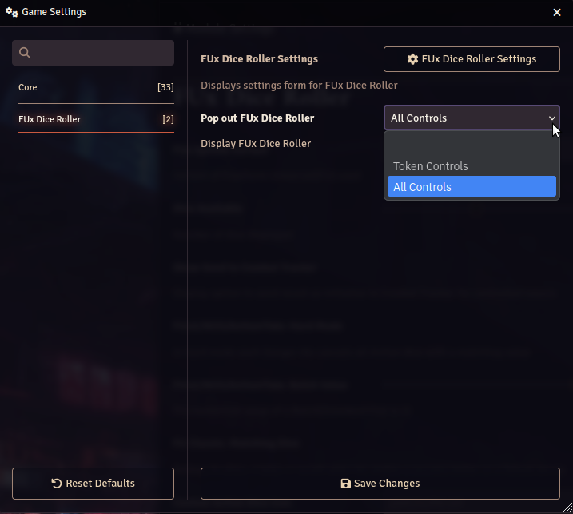
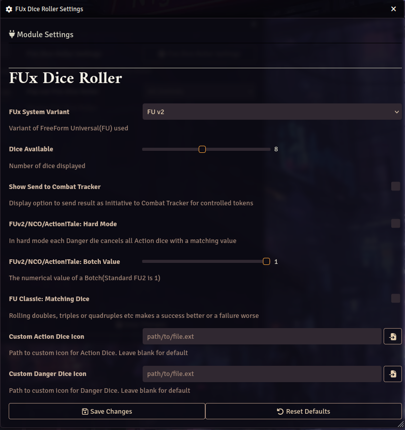

# FUx Dice Roller

Dice roller for FreeForm Universal(FU) RPG Classic & v2(beta), Action Tales! RPG(Dungeon Crawlers, Neon City Overdrive RPG, Hard City RPG, Star Scoundrels RPG, Tomorrow City), Earthdawn - Age Of Legend

Built-in support for 

- Dice So Nice

The dice roller is not dependent on any specific Foundry game system. This module was originally developed by [Anders Forslund](https://github.com/Anderware) and forked from [Anderware/FUx-Dice-Roller](https://github.com/Anderware/FUx-Dice-Roller).


## Installation

### Manifest URL

https://github.com/neovatar/FUx-Dice-Roller/releases/latest/download/module.json

See [Foundry Wiki - How to install a module](https://foundryvtt.wiki/en/basics/Modules) on help on how to use the manifest URL to install a module.

## Variants

 - FU v2 (as taken from FU v2 beta)

 - Neon City Overdrive/Action! Tales

 - FU Classic
   - in Classic, the roller will reduce selected Action (Start + Bonus)/Danger(Penalty)dice before the roll. The oracle used for Classic is the alternative numbering(1-3 Bad, 4-6 Good result) and not the default Even/Odd due to programming reasons.

- Earthdawn - Age of Legend
    - in EDAoL, the roll is always 1d6 plus a reduced set of negative and/or  positive fudge dice(1d6 where 5-6 means +/- else ignored)

## Using FUx Dice Roller

### Scene toolbar icon

The dice roller can be launched by clicking the dice icon on the Foundry VTT scene tools. The default setting is to show the dice roller icon as last icon of the token tools. You can also change this setting and show the icon as last icon of all tools.



### Roll commands from chat

FUx Dice roller support chat commands to roll

Command format

```
/fux xayd
```

where x is the number of Action Dice and y is the number of Danger Dice

*Example.*

*This will roll 2 Action Dice and 1 Danger Dice*

```
/fux 2a1d
```



## Settings

Open "configure Settings" in your Foundry VTT settings and choose "FUx Dice Roller". You can open the "FUX Dice Roller Settings" here. You can also choose on which toolbar you want to add the FUx Dice Rolle icon (default: Token Tools).



In the "FUx Dice Roller Settings" dialogue, you can choose the system variant you want to use. You can also set a few tweaks like hard mode.


